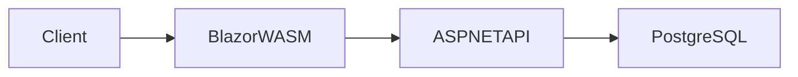
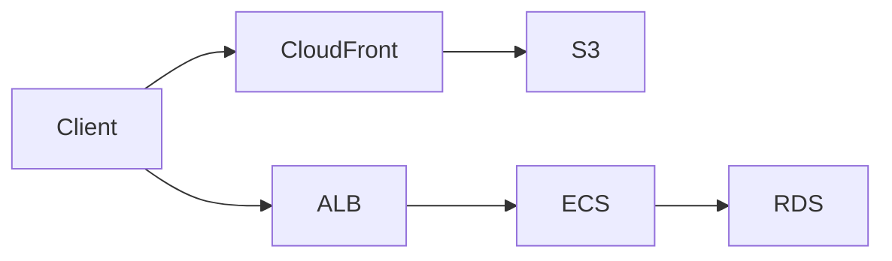
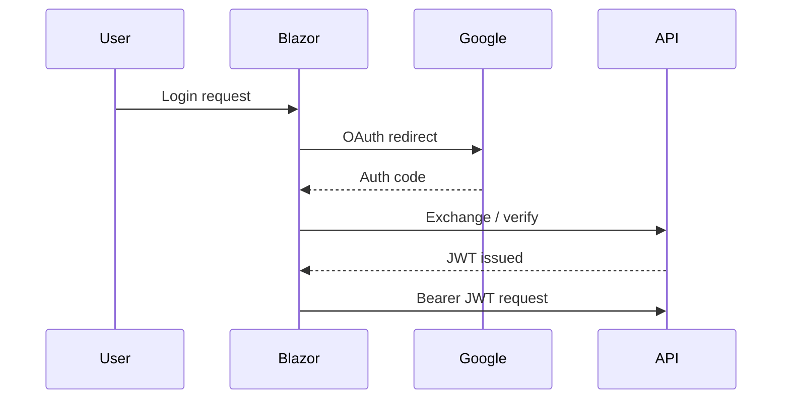

# 🎨 PlasticModelApp 🤖

## 1. 概要

**PlasticModelApp**は、プラモデル製作を強力に支援することを目指すWebアプリケーションです。プラモデル製作に対するUXを向上させ、創造性と製作効率を高め、ユーザーがより良い作品を生み出せるようサポートします。

本リポジトリはポートフォリオ用途として公開しており、以下を主目的としています。

- ASP.NET Core を用いた Web API 設計
- Blazor WASM による SPA フロントエンド
- Google OAuth 認証の実装
- PostgreSQL を用いたデータ設計
- 将来的な AWS 本番運用を想定した構成設計

---

## 2. アーキテクチャ

### Current (Render Hosting)



### Future (AWS Migration Plan)



---

## 3. 技術スタック

| Layer        | Technology                        |
| ------------ | --------------------------------- |
| Frontend     | Blazor WebAssembly                |
| Backend      | ASP.NET Core Web API              |
| Language     | C#                                |
| Database     | PostgreSQL                        |
| ORM          | Entity Framework Core             |
| Auth         | Google OAuth + JWT                |
| Hosting      | Render.com                        |
| Future Infra | AWS (S3 / CloudFront / ECS / RDS) |

---

## 4. 認証フロー



- Google OAuth により認証
- API 側で JWT を発行
- 以降の API アクセスは Bearer Token にて認可

---

## 5. 設計ポリシー

本アプリケーションは以下の設計方針を意識して実装しています。

- オニオンアーキテクチャ
- ドメインモデル中心設計
- 責務分離（Controller / Application / Domain / Infra)

---

## 6. DB設計

主要テーブル構成：

- Paints
- Brands
- Glosses
- Tags
- PaintTags（中間）

設計方針：

- 検索性能を考慮したインデックス付与
- ソート用モデル番号分解カラム
- 外部キー制約による整合性担保

（ER図は後日追加予定）

---

## 7. API エンドポイント（一部）

| Method | Path             | Description |
| ------ | ---------------- | ----------- |
| POST   | /api/paints      | 塗料検索　　 |
| GET    | /api/paints/{id} | 塗料詳細取得 |
| GET    | /api/masters     | 検索用マスタ取得 |

Swagger により詳細仕様を確認可能。

---

## 8. 非機能要件

- JWT 認証による API 保護
- 構造化ログ出力
- 例外ハンドリング統一
- CORS 制御
- 将来的なレート制限導入を想定

---

## 9. インフラ/デプロイ

### 現在

- Render.com にてホスティングおよびDB接続
- PostgreSQL 外部接続

### 将来

- Frontend：S3 + CloudFront
- API：ECS Fargate + ALB
- DB：RDS for PostgreSQL
- Secrets：SSM / Secrets Manager
- Monitoring：CloudWatch
- IaC：Terraform
- CI/CD：GitHub Actions

---

## 10. ローカル開発環境

### 必須

* .NET SDK
* Node.js（Blazor ビルド補助）
* PostgreSQL

### セットアップ

```bash
git clone <repo>
cd src

# DB migration
dotnet ef database update

# Run API
dotnet run

# Run frontend
dotnet run
```

---

## 11. Roadmap

* AWS 環境への移行
* Terraform による IaC 化
* React フロントエンド検証
* 検索性能最適化
* キャッシュ導入
* 認可（RBAC）追加
