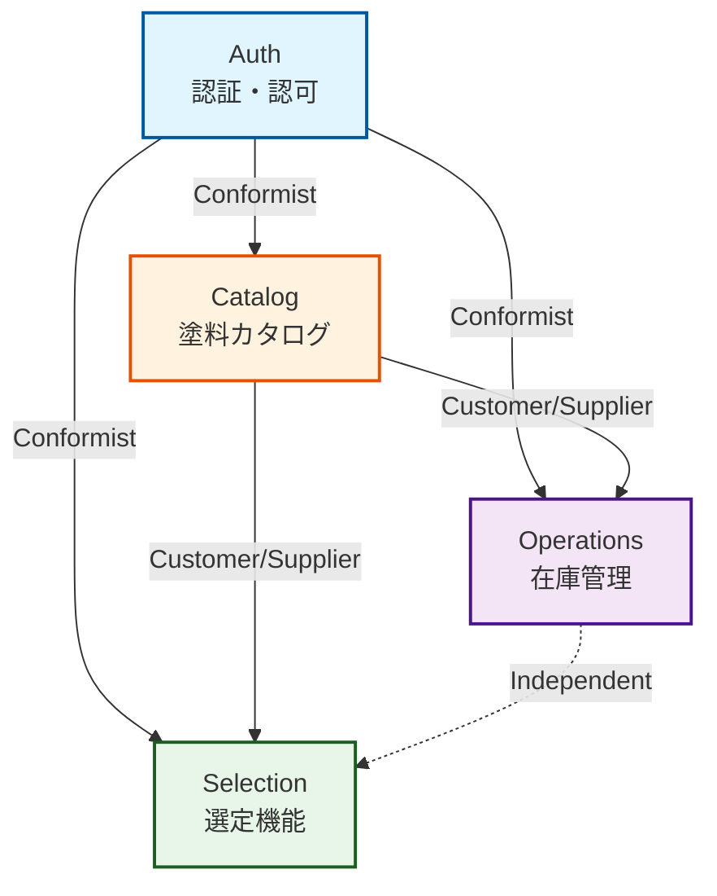

# 境界づけられたコンテキスト

PlasticModelAppの **境界づけられたコンテキスト** (Bounded Context, BC)を定義する。

## 1. コンテキスト一覧

| ID | 名称 | 種別 | 説明 |
| - | - | - | - |
| BC1 | Selection | コア | ユーザーに、塗料比較・選定の体験を提供する。 |
| BC2 | Catalog | 補完 | 他BCやユーザーに、塗料の事実データを提供する。 |
| BC3 | Operation | 補完 | 他BCやユーザーに、塗料の在庫管理や再購入あり/なしの管理を提供する。 |
| BC4 | Auth | 一般 | 他BCやユーザーに、認証や認可を提供する。 |

## 2. コンテキストマップ

**凡例**:

- **実線矢印**: 依存関係（下流→上流）
- **点線**: 独立関係（依存なし）
