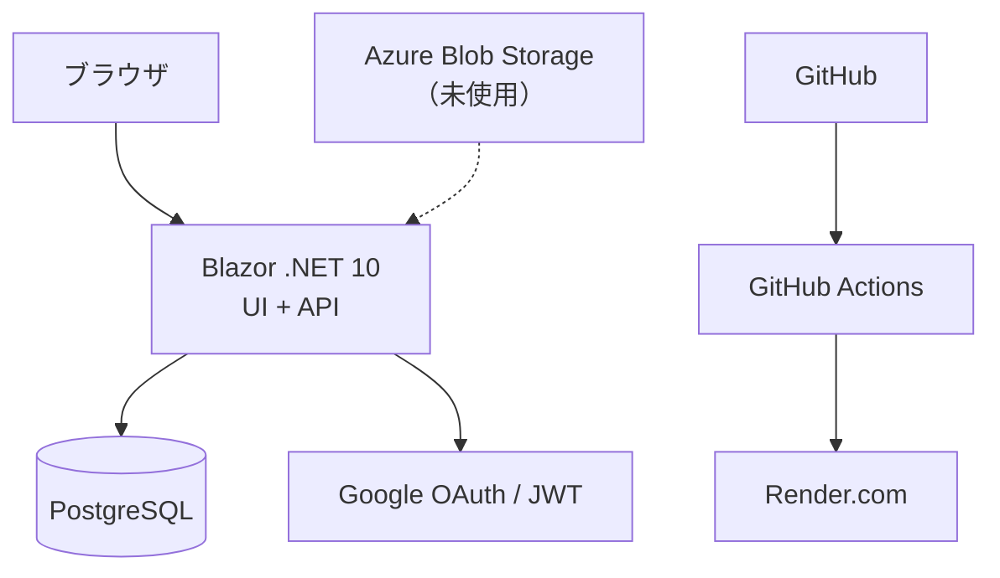

# システムアーキテクチャ

| 項目 | 技術 | バージョン | 目的 |
| ------ | ------ | ------------ | ------ |
| アプリケーション | Blazor / .NET 10 | 10.0+ | UI + API 統合 |
| データベース | PostgreSQL | 17.x | データ永続化 |
| 認証 | Google OAuth | - | ユーザー認証 |
| 認可 | JWT | - | API 認可 |
| CI/CD | GitHub Actions | - | ビルド・テスト・デプロイ |
| ホスティング | Render.com | - | PaaS ホスティング |
| 外部ストレージ | Azure Blob Storage | - | 現時点は未使用（画像検索には利用しない） |

