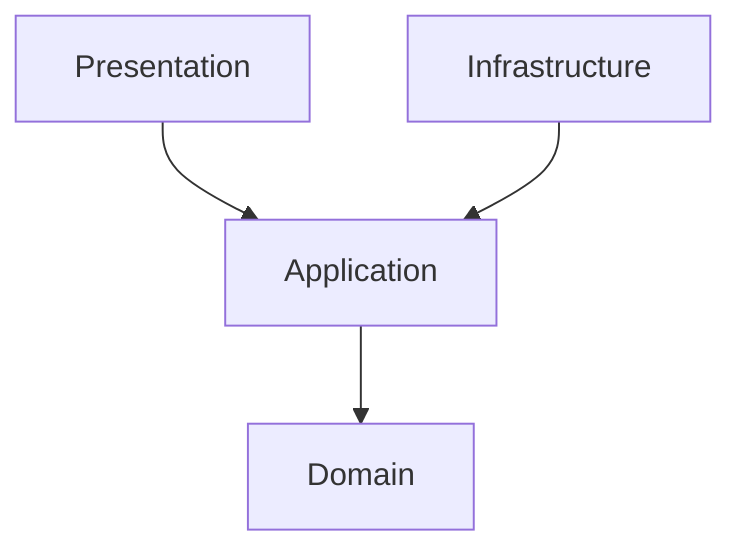
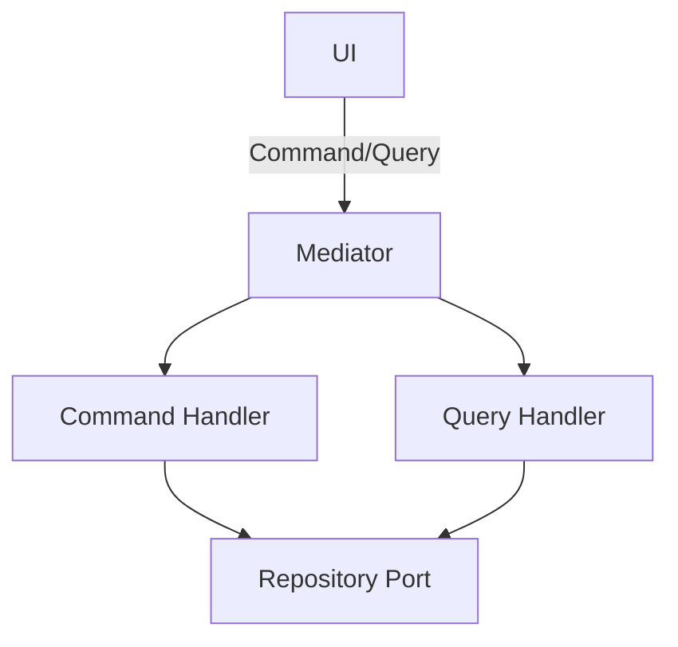

# アプリケーションアーキテクチャ

本アプリケーションでは、**オニオンアーキテクチャ** を採用しています。

## CQRS と Mediator

- 読み取り（Query）と書き込み（Command）を分離する
- Application 層で UseCase を Command/Query として実装する
- MediatR 等のメディエーター（Mediator）を用いて、UI から UseCase 呼び出しを疎結合に保つ

