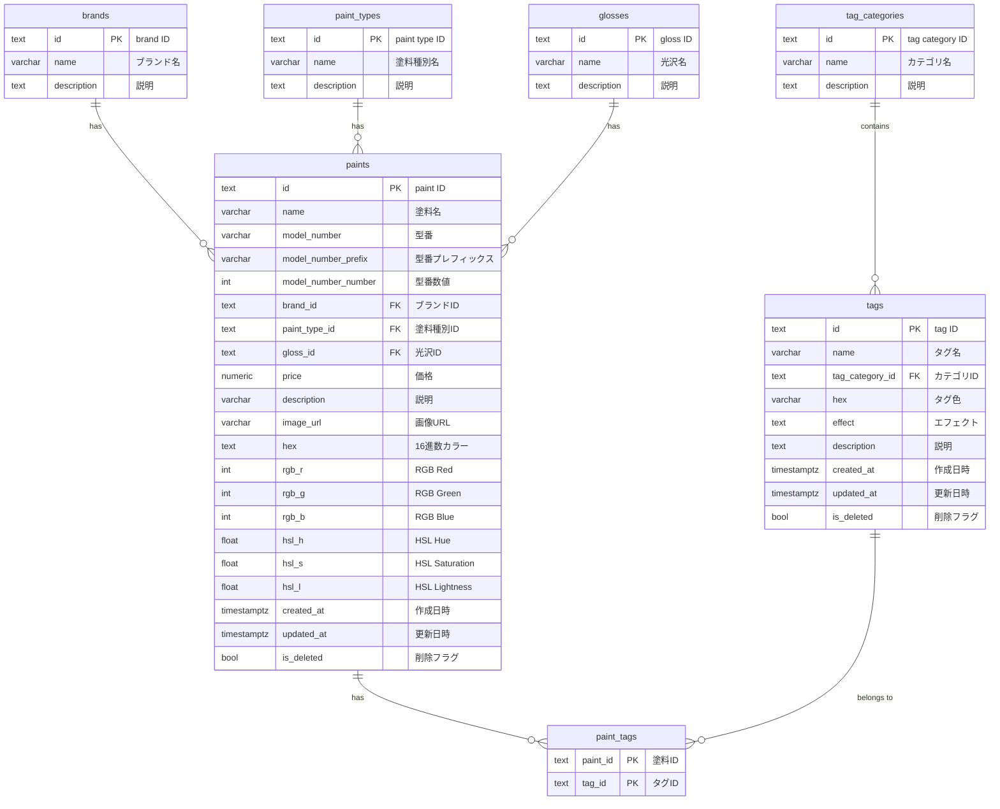

# ER図

```mermaid
erDiagram
    %% Master Data
    brands ||--o{ paints : "has"
    paint_types ||--o{ paints : "has"
    glosses ||--o{ paints : "has"
    tag_categories ||--o{ tags : "contains"

    %% Paint relationships
    paints ||--o{ paint_tags : "has"
    tags ||--o{ paint_tags : "belongs to"

    paints {
        text id PK "paint ID"
        varchar name "塗料名"
        varchar model_number "型番"
        varchar model_number_prefix "型番プレフィックス"
        int model_number_number "型番数値"
        text brand_id FK "ブランドID"
        text paint_type_id FK "塗料種別ID"
        text gloss_id FK "光沢ID"
        numeric price "価格"
        varchar description "説明"
        varchar image_url "画像URL"
        text hex "16進数カラー"
        int rgb_r "RGB Red"
        int rgb_g "RGB Green"
        int rgb_b "RGB Blue"
        float hsl_h "HSL Hue"
        float hsl_s "HSL Saturation"
        float hsl_l "HSL Lightness"
        timestamptz created_at "作成日時"
        timestamptz updated_at "更新日時"
        bool is_deleted "削除フラグ"
    }

    brands {
        text id PK "brand ID"
        varchar name "ブランド名"
        text description "説明"
    }

    paint_types {
        text id PK "paint type ID"
        varchar name "塗料種別名"
        text description "説明"
    }

    glosses {
        text id PK "gloss ID"
        varchar name "光沢名"
        text description "説明"
    }

    tags {
        text id PK "tag ID"
        varchar name "タグ名"
        text tag_category_id FK "カテゴリID"
        varchar hex "タグ色"
        text effect "エフェクト"
        text description "説明"
        timestamptz created_at "作成日時"
        timestamptz updated_at "更新日時"
        bool is_deleted "削除フラグ"
    }

    tag_categories {
        text id PK "tag category ID"
        varchar name "カテゴリ名"
        text description "説明"
    }

    paint_tags {
        text paint_id PK "塗料ID"
        text tag_id PK "タグID"
    }
```
