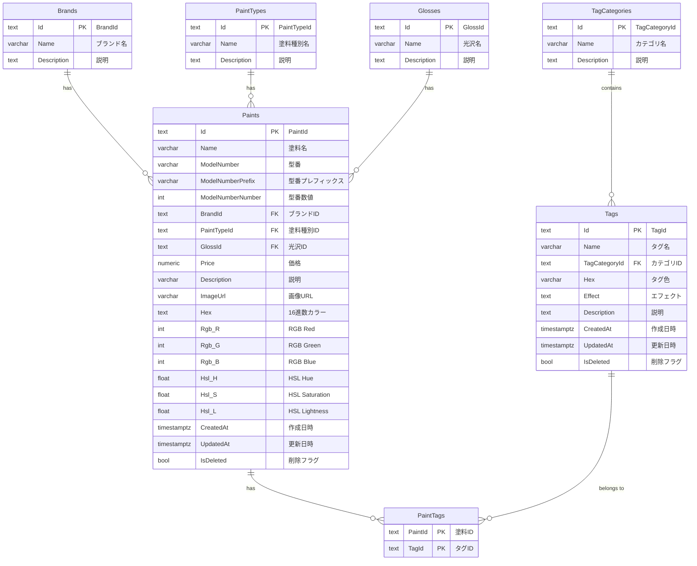

# ER図

```mermaid
erDiagram
    %% Master Data
    Brands ||--o{ Paints : "has"
    PaintTypes ||--o{ Paints : "has"
    Glosses ||--o{ Paints : "has"
    TagCategories ||--o{ Tags : "contains"

    %% Paint relationships
    Paints ||--o{ PaintTags : "has"
    Tags ||--o{ PaintTags : "belongs to"

    Paints {
        text Id PK "PaintId"
        varchar Name "塗料名"
        varchar ModelNumber "型番"
        varchar ModelNumberPrefix "型番プレフィックス"
        int ModelNumberNumber "型番数値"
        text BrandId FK "ブランドID"
        text PaintTypeId FK "塗料種別ID"
        text GlossId FK "光沢ID"
        numeric Price "価格"
        varchar Description "説明"
        varchar ImageUrl "画像URL"
        text Hex "16進数カラー"
        int Rgb_R "RGB Red"
        int Rgb_G "RGB Green"
        int Rgb_B "RGB Blue"
        float Hsl_H "HSL Hue"
        float Hsl_S "HSL Saturation"
        float Hsl_L "HSL Lightness"
        timestamptz CreatedAt "作成日時"
        timestamptz UpdatedAt "更新日時"
        bool IsDeleted "削除フラグ"
    }

    Brands {
        text Id PK "BrandId"
        varchar Name "ブランド名"
        text Description "説明"
    }

    PaintTypes {
        text Id PK "PaintTypeId"
        varchar Name "塗料種別名"
        text Description "説明"
    }

    Glosses {
        text Id PK "GlossId"
        varchar Name "光沢名"
        text Description "説明"
    }

    Tags {
        text Id PK "TagId"
        varchar Name "タグ名"
        text TagCategoryId FK "カテゴリID"
        varchar Hex "タグ色"
        text Effect "エフェクト"
        text Description "説明"
        timestamptz CreatedAt "作成日時"
        timestamptz UpdatedAt "更新日時"
        bool IsDeleted "削除フラグ"
    }

    TagCategories {
        text Id PK "TagCategoryId"
        varchar Name "カテゴリ名"
        text Description "説明"
    }

    PaintTags {
        text PaintId PK "塗料ID"
        text TagId PK "タグID"
    }
```
