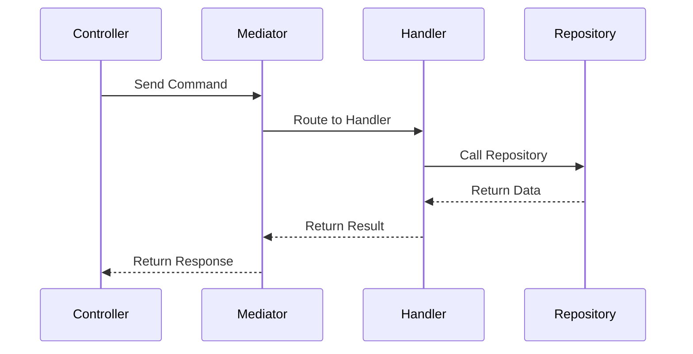
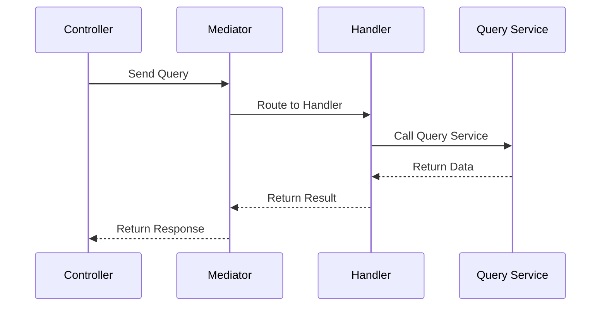

# API実装方針

## 概要

本ドキュメントでは、APIの実装ルールについて説明します。

## APIフロー

APIは、Clean Architecture、CQRSおよびMediatorパターンに基づいて設計されます。以下のフローで処理が行われます。

1. **コントローラー**: APIエンドポイントでリクエストを受け取り、Mediatorにコマンドまたはクエリを送信します。
2. **Mediator**: 適切なハンドラーにリクエストをルーティングします。
3. **ハンドラー**: ビジネスロジックを実行し、必要に応じてリポジトリからデータを取得または保存します。
4. **リポジトリ**: データベースや外部サービスとのやり取りを担当します。
5. **レスポンス**: ハンドラーからの結果をコントローラーが受け取り、クライアントに返します。

## 例 (command)

## 例 (query)

