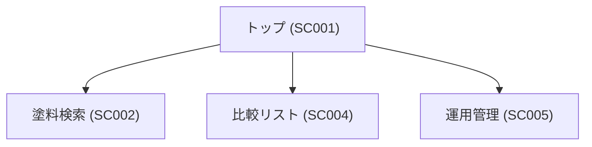
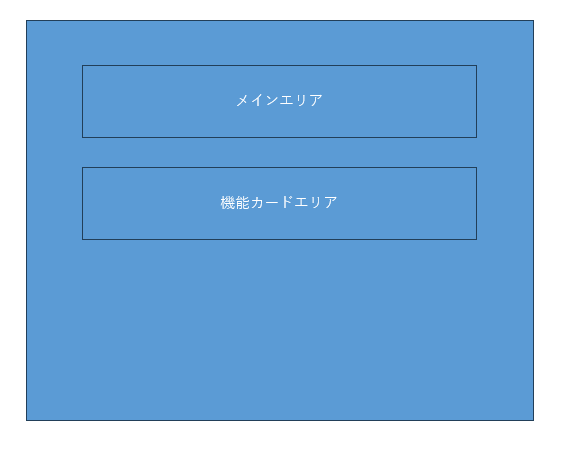

# SC001: トップ

## 概要

| 項目 | 内容 |
| --- | --- |
| 画面ID | SC001 |
| 画面名 | トップ |
| 概要 | アプリケーションのトップページ |
| URL | `/` |
| 主な操作 | 各機能へのナビゲーション |

---

## 画面遷移

## 画面レイアウト

| ID | エリア名 | 説明 |
| --- | --- | --- |
| AREA001 | メインエリア | ウェルカムメッセージ等が入ります。 |
| AREA002 | 機能カードエリア | 各機能へのリンクボタンが配置されます。 |

---

## UIコンポーネント一覧

| ID | コンポーネント名 | 種類 | 説明 |
| --- | --- | --- | --- |
| COMP-001-01 | ウェルカムメッセージ | テキスト | ユーザーへの挨拶メッセージを表示します。 |
| COMP-001-02 | 機能カード | ボタン | 各主要機能へのナビゲーションボタンです。 |

---

## 処理内容

| ID | 処理名 | 説明 |
| --- | --- | --- |
| EV-001-01 | 画面表示 | トップ画面を表示します。 |
| EV-001-02 | 機能選択 | ユーザーが機能カードをクリックした際に対応する画面へ遷移します。 |

---

## 表示権限

なし

---

## バリデーション

なし

---

## エラー処理

| ID | エラー名 | 説明 | 対応方法 |
| --- | --- | --- | --- |
| ERR001 | 画面表示エラー | トップ画面の表示に失敗した場合 | エラーメッセージを表示し、再試行を促す |
| ERR002 | ナビゲーションエラー | 機能カードのクリック時に遷移できない場合 | エラーメッセージを表示し、トップ画面に留まる |
