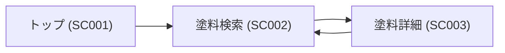
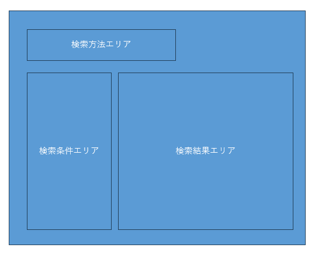

# SC002: 塗料検索

## 概要

| 項目 | 内容 |
| --- | --- |
| 画面ID | SC002 |
| 画面名 | 塗料検索 |
| 概要 | 塗料を検索・閲覧する画面 |
| URL | `/search/paints` |
| 主な操作 | 検索、フィルタリング、塗料詳細の表示 |

---

## 画面遷移

## 画面レイアウト

| ID | エリア名 | 説明 |
| --- | --- | --- |
| AREA001 | 検索方法エリア | 検索方法を選択するエリアです。 |
| AREA002 | 検索条件エリア | 検索結果を絞り込むためのフィルターが配置されます。 |
| AREA003 | 検索結果エリア | 検索結果の塗料リストが表示されます。 |

---

## UIコンポーネント一覧

| ID | コンポーネント名 | 種類 | 説明 |
| --- | --- | --- | --- |
| COMP-002-01 | 検索方法セレクタ | ボタングループ | 検索方法の切り替えを行います。 |
| COMP-002-02 | フィルター | タグチップ/ドロップダウン | 検索結果を絞り込むための条件を設定します。 |
| COMP-002-03 | カラーピッカー | カラーピッカー | 色相・明度・彩度で近似色の塗料を検索します。 |
| COMP-002-04 | 画像アップロード | ファイル入力 | 画像から抽出した色をもとに近似色の塗料を検索します。 |
| COMP-002-05 | 塗料リスト | リストビュー | 検索結果の塗料を一覧表示します。 |
| COMP-002-06 | 塗料カード | カードビュー | 各塗料の基本情報を表示します。 |
| COMP-002-07 | ページネーション | ページナビゲーション | 検索結果のページ切り替えを行います。 |

---

## 処理内容

| ID | 処理名 | 説明 |
| --- | --- | --- |
| EV-002-01 | 画面表示 | 塗料検索画面を表示します。 |
| EV-002-02 | 検索方法選択 | ユーザーが検索方法を選択した際に対応する入力エリアを表示します。 |
| EV-002-03 | フィルター適用 | ユーザーがフィルターを設定した際に検索条件を作成します。 |
| EV-002-04 | カラーピッカー操作 | ユーザーがカラーピッカーで色を選択した際に検索条件を作成します。 |
| EV-002-05 | 画像アップロード | ユーザーが画像をアップロードし、クリックした際に色を抽出し、検索条件を作成します。 |
| EV-002-06 | 検索実行 | ユーザーが検索ボタンをクリックした際に検索を実行し、結果を表示します。 |
| EV-002-07 | 条件リセット | ユーザーがリセットボタンをクリックした際に検索条件と結果を初期化します。 |
| EV-002-08 | 塗料詳細表示 | ユーザーが塗料カードをクリックした際に塗料詳細画面へ遷移します。 |
| EV-002-09 | ページ切り替え | ユーザーがページネーションを操作した際に対応する検索結果ページを表示します。 |

---

## 表示権限

なし

---

## バリデーション

| ID | バリデーション名 | 説明 |
| --- | --- | --- |
| VAL-002-01 | 画像チェック | アップロードされた画像がサポートされている形式（JPEG, PNG）とサイズ（5MB以下）であることを確認します。 |

---

## エラー処理

| ID | エラー名 | 説明 | 対応方法 |
| --- | --- | --- | --- |
| ERR-002-01 | 画像アップロード失敗 | 画像のアップロードに失敗した場合に発生します。 | ユーザーにエラーメッセージを表示し、再度アップロードを促します。 |
| ERR-002-02 | 無効な条件 | 検索条件が無効な場合に発生します。 | ユーザーにエラーメッセージを表示し、条件の修正を促します。 |

---

## API連携

| エンドポイント | API名 | 説明 |
| --- | --- | --- |
| `POST /api/paints/search` | 塗料検索 API | 指定された検索条件に基づいて塗料を検索し、結果を返します。 |
| `POST /api/paints/color-search` | 近似色検索 API | 指定された色情報に基づいて近似色の塗料を検索し、結果を返します。 |
