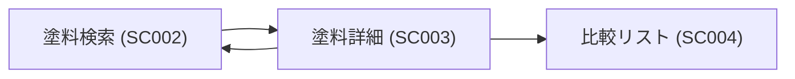
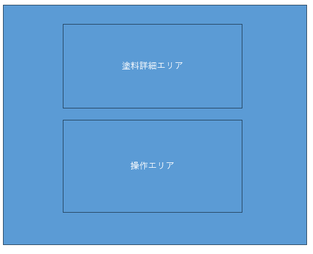

# SC003: 塗料詳細

## 概要

| 項目 | 内容 |
| --- | --- |
| 画面ID | SC003 |
| 画面名 | 塗料詳細 |
| 概要 | 選択した塗料の詳細情報を表示 |
| URL | `/paint/{paintId}` |
| 主な操作 | 塗料情報の閲覧、メモの追加、比較リストへの追加 |

---

## 画面遷移

## 画面レイアウト

| ID | エリア名 | 説明 |
| --- | --- | --- |
| AREA001 | 塗料詳細エリア | 選択した塗料の詳細情報が表示されます。 |
| AREA002 | 操作エリア | メモや比較リストへの追加ボタンが配置されます。 |

---

## UIコンポーネント一覧

| ID | コンポーネント名 | 種類 | 説明 |
| --- | --- | --- | --- |
| COMP-003-01 | 塗料詳細カード | カードビュー | 選択した塗料の詳細情報を表示します。 |
| COMP-003-02 | メモ入力欄 | テキストエリア | ユーザーが塗料に関するメモを追加・編集できます。 |
| COMP-003-03 | 比較リスト追加ボタン | ボタン | 選択した塗料を比較リストに追加します。 |

---

## 処理内容

| ID | 処理名 | 説明 |
| --- | --- | --- |
| EV-003-01 | 画面表示 | 塗料詳細画面を表示します。 |
| EV-003-02 | メモ操作 | ユーザーがメモを追加・編集した際に保存します。 |
| EV-003-03 | 比較リスト操作 | ユーザーが比較リストに塗料を追加した際に処理を行います。 |

---

## 表示権限

| エリア名 | 権限 |
| --- | --- |
| 塗料詳細エリア | 全ユーザー |
| 操作エリア | 認証ユーザーのみ |

---

## バリデーション

| ID | 項目 | 条件 | エラーメッセージ |
| --- | --- | --- | --- |
| VAL-003-01 | メモ内容 | 文字数制限（最大500文字） | "メモは最大500文字まで入力可能です。" |

---

## エラー処理

| ID | 処理名 | エラー内容 | 対応 |
| --- | --- | --- | --- |
| ERR-003-01 | 画面表示 | 塗料データが存在しない | "選択した塗料は存在しません。" メッセージを表示 |
| ERR-003-02 | メモ保存 | サーバーエラー | "メモの保存に失敗しました。再度お試しください。" メッセージを表示 |
| ERR-003-03 | 比較リスト追加 | サーバーエラー | "比較リストの保存に失敗しました。再度お試しください。" メッセージを表示 |

---

## API連携

| エンドポイント | API名 | 説明 |
| --- | --- | --- |
| `GET /api/paints/{paintId}` | 塗料詳細取得 API | 指定した塗料IDの詳細情報を取得します。 |
